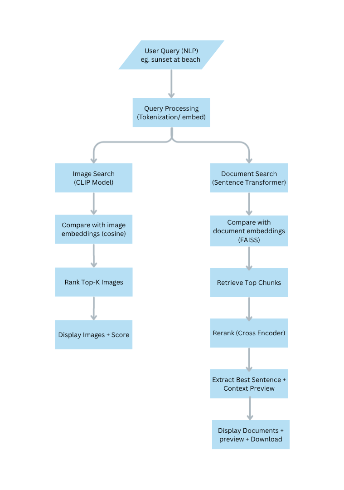
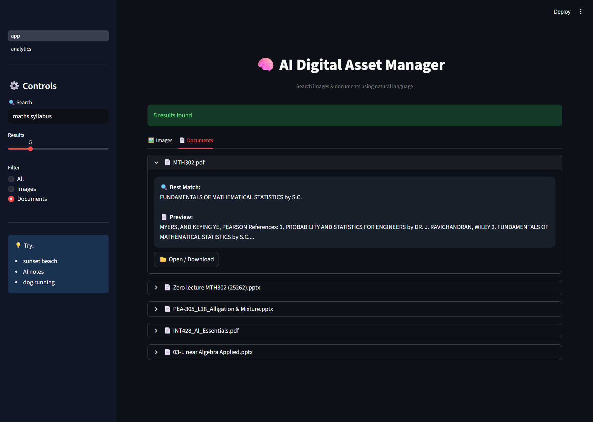
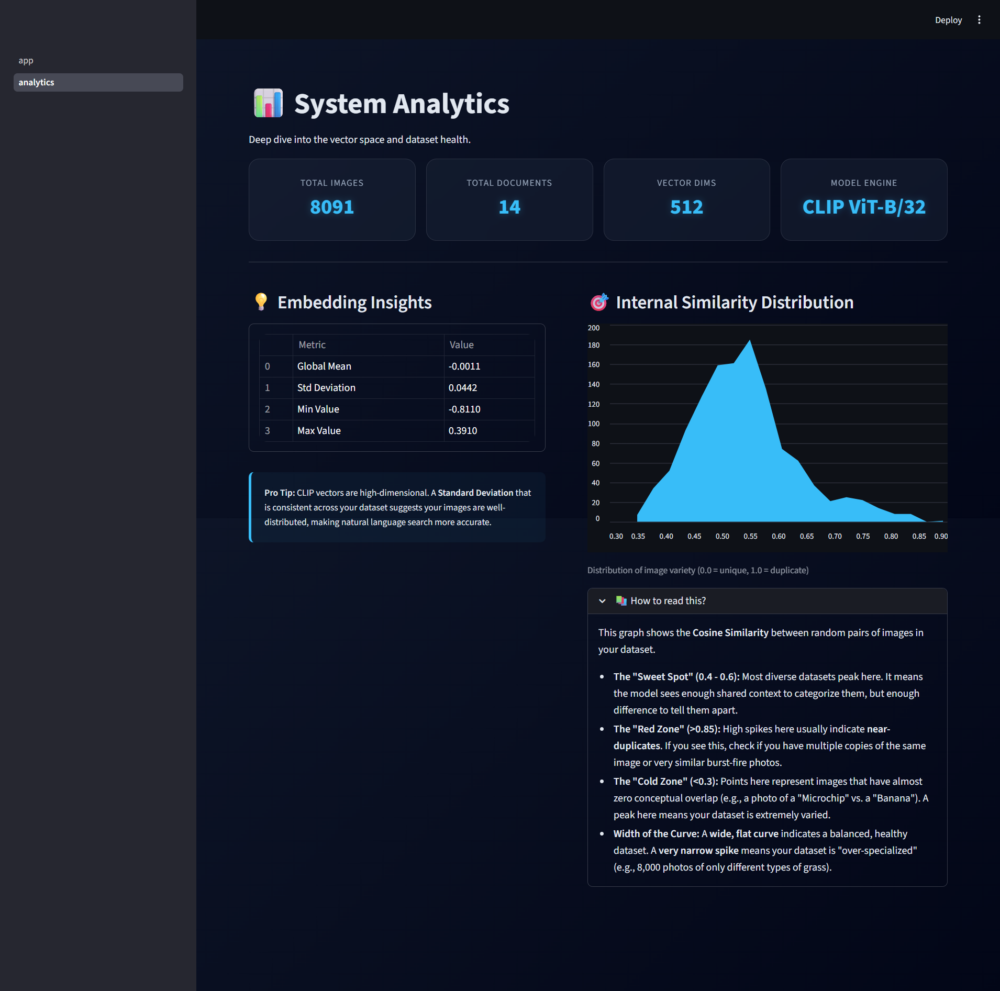

# ⬡ AI Digital Asset Manager

> **Multimodal semantic search** for your local images and documents — powered by CLIP, Sentence-Transformers, FAISS, and a CrossEncoder reranker.  
> Everything runs **100 % locally** — no paid APIs, no cloud, no GPU required.

## Tech Stack

- **Python 3.9+**
- **Streamlit** — user interface
- **OpenAI CLIP** — image-text alignment
- **Sentence Transformers** — document embeddings and cross-encoder reranking
- **FAISS** — approximate nearest-neighbour search
- **PyMuPDF** — PDF text extraction
- **python-docx** — DOCX parsing
- **python-pptx** — PPTX parsing


## Features

| Capability | Implementation |
|---|---|
| Image semantic search | CLIP ViT-B/32 |
| Document parsing | PyMuPDF, python-docx, python-pptx |
| Document embedding | Sentence Transformers (BAAI/bge-base-en-v1.5) |
| Search by filename | Toggle for fast substring matching |
| Fast candidate retrieval | FAISS IndexFlatIP (cosine similarity) |
| Result reranking | CrossEncoder (ms-marco-MiniLM-L-6-v2) |
| Best-sentence extraction | Sentence-level cosine similarity |
| Document preview | Highlighted matching sentence + context |
| Image embedding cache | Pickle file — avoids re-encoding on restart |
| Fully offline | No external APIs or network calls |


## Project Structure

```
CLIP_AI_DAM/
├── DataSet/
│   ├── Images/              # Place your images here (JPG, PNG, WEBP, etc.)
│   └── Documents/           # Place your documents here (PDF, DOCX, PPTX)
│
├── embeddings/
│   └── image_embeddings.pkl # Auto-generated CLIP embedding cache
│
├── src/
|   ├──pages
|      ├──analytics.py       # Presents system & dataset analytics
│   ├── app.py               # Streamlit application entry point
│   ├── document_search.py   # Document extraction, chunking, FAISS, reranking
│   └── encode_images.py     # CLIP image encoding and similarity search
│
├── requirements.txt
└── README.md
```

> **Note:** The `DataSet/` directories and `image_embeddings.pkl` are excluded from the repository. Add your own files locally before running the app.

## Installation and Setup

### 1. Clone the repository

```bash
git clone https://github.com/your-username/CLIP_AI_DAM.git
cd CLIP_AI_DAM
```

### 2. Create and activate a virtual environment

```bash
python -m venv .venv

# macOS / Linux
source .venv/bin/activate

# Windows
.venv\Scripts\activate
```

### 3. Install dependencies

```bash
pip install -r requirements.txt
```

CLIP is not available on PyPI and must be installed directly from GitHub:

```bash
pip install git+https://github.com/openai/CLIP.git
```

> **Note for macOS (Apple Silicon):** If `faiss-cpu` fails to install via pip, use:
> ```bash
> conda install -c conda-forge faiss-cpu
> ```

### 4. Add your data

```
DataSet/Images/       ← JPG, JPEG, PNG, BMP, WEBP, GIF
DataSet/Documents/    ← PDF, DOCX, PPTX
```

### 5. Run the application

```bash
streamlit run src/app.py
or 
python -m streamlit run src/app.py
```

Open [http://localhost:8501](http://localhost:8501) in your browser.


## 🔍 How It Works

### Image Search
1. On first run, every image is encoded into a 512-D CLIP embedding and cached to `embeddings/image_embeddings.pkl`.
2. Your query is encoded with the same CLIP text encoder.
3. Cosine similarity (dot product on L2-normalised vectors) ranks images.

### Document Search
1. Text is extracted from PDF / DOCX / PPTX files.
2. Text is chunked into overlapping 300-word segments.
3. Chunks are embedded with `all-mpnet-base-v2` and stored in a FAISS index (in memory).
4. Top-20 candidates are retrieved from FAISS, then reranked by the CrossEncoder.
5. The best single sentence from the winning chunk is highlighted in the UI.

### Flow Diagram


## ⚙️ Tuning

| Parameter | Location | Default | Effect |
|---|---|---|---|
| `CHUNK_SIZE` | `document_search.py` | 300 words | Larger = more context, slower |
| `CHUNK_OVERLAP` | `document_search.py` | 50 words | Reduces boundary misses |
| `faiss_candidates` | `search_documents()` | 20 | Candidates fed to reranker |
| Top-K slider | Streamlit sidebar | 5 | Final results shown |


## 🗑️ Resetting the Image Cache

Delete `embeddings/image_embeddings.pkl` and restart the app.  
The cache is rebuilt automatically on the next run.


## 📦 Dependencies at a Glance

```
streamlit          ← UI
torch / torchvision← Deep learning runtime
openai-clip        ← Image-text matching
Pillow             ← Image I/O
numpy              ← Numerics
sentence-transformers ← Bi-encoder + CrossEncoder
faiss-cpu          ← Vector index
pymupdf (fitz)     ← PDF parsing
python-docx        ← DOCX parsing
python-pptx        ← PPTX parsing
```


## Screenshots






---

## Datasets Used

| Asset Type | Source | Included in Repo |
|---|---|---|
| Images | Flickr8k dataset | No |
| Documents | Local personal/test files | No |

> Both datasets are excluded from the repository for size and privacy reasons. Users are expected to supply their own files.


## Limitations

- The document index is rebuilt in memory on each application start. For very large libraries (thousands of documents), startup time may increase noticeably.
- Image embedding generation is CPU-bound. Encoding a large image library for the first time can be slow without a GPU.
- Text extraction quality depends on document structure. Scanned PDFs without embedded text are not currently supported.
- The system is optimised for English-language content.


## Future Improvements

- Persistent document index (saved to disk like the image cache) to avoid rebuilding on restart.
- OCR support for scanned PDF documents.
- Metadata filtering (file type, date range, size) alongside semantic search.
- Multi-language query support.
- Batch re-embedding triggered automatically when source files change.
- Web-accessible deployment option with user authentication.


## 🛡️ Privacy

All processing is local. No data is sent anywhere.


## Acknowledgements

- [OpenAI CLIP](https://github.com/openai/CLIP)
- [Sentence Transformers](https://www.sbert.net/)
- [FAISS](https://github.com/facebookresearch/faiss)
- [Streamlit](https://streamlit.io/)

